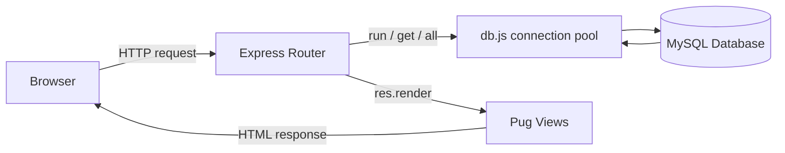

# Smart Transport Management System

A Node.js / Express / Pug / MySQL transport management system built for
Metropolitan University, Sylhet - routes, stops, buses, drivers,
students, official schedules, and a live route+date bus status checker
backed by a real relational database.

This README is a complete handover guide. If you've never seen this
project before, you should be able to get it running and understand how
it works using only this document.

## Table of Contents

1. [Project Overview](#project-overview)
2. [Key Features](#key-features)
3. [Architecture](#architecture)
4. [Project Structure](#project-structure)
5. [Requirements](#requirements)
6. [How to Run](#how-to-run)
7. [Database Setup](#database-setup)
8. [Demo and Login Accounts](#demo-and-login-accounts)
9. [Database Schema and Relationships](#database-schema-and-relationships)
10. [Bus Status Logic](#bus-status-logic)
11. [Database CRUD Flow](#database-crud-flow)
12. [Database Presentation and Viva Guide](#database-presentation-and-viva-guide)
13. [Full Website Testing Guide](#full-website-testing-guide)
14. [Troubleshooting](#troubleshooting)
15. [Project History](#project-history)

---

## Project Overview

Smart Transport Management System (STMS) is a server-rendered web
application that manages a university's bus transport for three kinds
of users:

- **Students** register with their official university email and their
  official Student ID (issued by the university - never auto-generated
  by this app), wait for an Admin to approve the account, then log in
  and check live bus status for any route and date.
- **Drivers** (accounts created by an Admin only) see their assigned
  bus/route and official schedule, control their trip (**Start Trip**,
  **End Trip**), and report a **Delay** or a **Breakdown** using
  structured forms (a reason, a location/stop, and - for a delay - a
  duration) instead of free text.
- **Admins** manage everything: students, drivers, buses, routes,
  stops, schedules, and can post official transport **Notices** (e.g.
  "Bus 11-0018 will not run today") that directly change what students
  see when they check that bus.

Anyone (no login needed) can browse the public **Routes**, **Timetable**
and **Notices** pages, and use **Find Your Bus** on the homepage to
search a stop and see a live-ish status computed from the schedule plus
any Driver notice.

Everything is backed by a single MySQL/MariaDB database
(`smart_transport_management`) running on XAMPP - there is no ORM, every
query is plain SQL, and nothing is hard-coded in the frontend.

## Key Features

**Public (no login required)**
- Homepage with Popular Routes, Latest Notices, and a "Find Your Bus"
  stop search (both directions: To Campus / From Campus)
- Routes page - every active route with its stops in order
- Timetable page - filterable by schedule period (Regular / Examination
  / Summer / Winter / Special)
- Notices page - every Admin notice and Driver delay/breakdown report,
  most recent first

**Students**
- Self-signup requiring a **real, official Student ID** (required, must
  be unique - there is no auto-generated fallback any more) and a
  university email
- Registration starts as `pending`; an Admin must approve it before login
  works
- **Student Dashboard - Check Bus Status:** pick a Route and a Date,
  and see every bus scheduled on that route for that day, each with its
  own live status - **On Time**, **Upcoming**, **Departed**,
  **Delayed**, **Breakdown**, or **Not Running** - plus the reason and
  an updated estimated time when delayed (see
  [Bus Status Logic](#bus-status-logic))

**Drivers** (accounts created by an Admin, never self-registered)
- Dashboard showing their assigned bus, route and official schedule
  (read-only - a Driver cannot edit routes, stops, or schedules)
- Trip controls: **Start Trip**, **End Trip**
- **Report a Delay** - Reason (Traffic / Bus Problem / Other), an
  optional Location/Stop picked from their own route's real stops, and a
  Delay Duration (10/20/30/40 minutes or 1 hour). The system
  automatically works out the new estimated arrival/departure time for
  every affected schedule - never a hard-coded estimate.
- **Report a Breakdown** - kept separate from a Delay - Reason
  (Mechanical Problem / Bus Fault / Other) and an optional Location/Stop

**Admins**
- Full CRUD on students, drivers, buses, routes, stops and schedules
- Approve / reject / suspend / re-activate / delete student accounts
- Activate / deactivate / delete driver accounts, assign a bus/route
- **Create Admin Notices** (Notice Management tab) - e.g. "Bus 11-0018
  will not run today," targeted at a specific bus or a whole route, on a
  specific date - these directly change what a Student sees for that
  bus on that date
- Delete any notice (Admin-created or Driver-reported)
- **Live Trips & Breakdowns** view: every currently active trip and any
  breakdown reports

## Architecture

STMS is a classic server-rendered MVC-style app - there is no separate
frontend framework and no JSON API; Express renders HTML (via Pug) on
every request.



- **Frontend:** Pug templates (`views/`) render every page server-side;
  plain HTML/CSS/JS - one stylesheet (`public/stylesheet/style.css`) and
  one small client-side script (`public/javascripts/main.js`) for things
  like dropdown menus and delete-confirmation dialogs. No React, no
  build step.
- **Backend:** Node.js + Express (`app.js`, `routes/index.js`) handles
  routing, sessions, and all business logic - including the bus status
  calculation described in [Bus Status Logic](#bus-status-logic).
- **Database:** MySQL/MariaDB (`db.js`, `config/database.js`) is the
  only data store, accessed through `mysql2/promise`. There is no ORM -
  every query is plain SQL.
- **Environment:** XAMPP's MySQL/MariaDB server. Apache is only needed
  if you also want phpMyAdmin.
- **Sessions, not tokens.** `express-session` stores who is logged in
  (`req.session.user = { id, role, ... }`). A `requireRole(role)`
  middleware function re-checks the role on the server for every
  protected route - hiding a button in the UI is never treated as
  enough access control on its own.
- **Three completely separate login flows** (`/login-admin`,
  `/login-driver`, `/login-student`) because each role reads from a
  different table (`admins`, `drivers`, `students`) with different rules
  (e.g. a student's account `status` must be `approved`, and login needs
  the email **and** the exact Student ID together).
- **Passwords** are never stored in plain text. `db.js` hashes them with
  salted PBKDF2 (100,000 iterations, Node's built-in `crypto` module -
  no external hashing library) and compares with a timing-safe check on
  login.

## Project Structure

Only the files/folders that matter for understanding or running the
project are listed - `node_modules/` and IDE-generated files
(`.vscode/`, `*.esproj`, `*.slnx`) are omitted.

| Path | What it does |
|---|---|
| `app.js` | Builds the Express app: view engine (Pug), session/body/static middleware, and mounts the two routers. |
| `bin/www` | The real entry point (`npm start` runs this). Waits for `db.initDatabase()` to finish before the HTTP server starts listening, so the app never accepts a request before MySQL is actually ready. |
| `db.js` | The entire database layer: creates the `mysql2/promise` connection pool, exposes `run` / `get` / `all` helpers used everywhere else, creates the schema (`CREATE TABLE IF NOT EXISTS` for all 11 tables), automatically **upgrades an older `notices` table** if this is an existing installation (see `migrateNoticesTable()`), seeds demo data on first run, and holds the password hashing (`hashPassword` / `verifyPassword`). |
| `config/database.js` | Reads DB connection settings from `.env` (with safe XAMPP defaults). The one and only place connection details are configured. |
| `config/googleApi.js` | Reserved, currently-**inactive** placeholder for a future GPS/live-tracking integration - nothing in the app uses this today. |
| `.env` | Your local database host/port/user/password/name and the app's HTTP port. Already filled in with XAMPP's defaults (`root`, no password). |
| `package.json` | Dependencies, plus the two npm scripts: `npm start` and `npm run db:demo`. |
| `routes/index.js` | Almost the whole application: every public page, all three logins, signup, the Admin Panel, Driver Dashboard, Student Dashboard, and every CRUD action - including the Bus Status Logic (see below). |
| `routes/users.js` | Leftover default file from the Express project generator (mounted at `/users`). Not used by any real feature of this project - safe to ignore. |
| `views/` | One Pug template per page, plus `views/partials/` for shared pieces (header, footer, flash messages, form mixins). |
| `public/` | Static files served as-is: `stylesheet/style.css` and `javascripts/main.js`. |
| `utils/viewHelpers.js` | Small formatting helpers (12-hour time, title case, human-readable dates) available inside every Pug template. |
| `database/smart_transport_management.sql` | Full schema + seed data dump, generated to exactly match `db.js`. Lets you (re)create the database by importing it in phpMyAdmin instead of letting the app create it automatically. |
| `database/demo_operations.sql` | The MySQL/MariaDB terminal viva demonstration script - see [Database Presentation and Viva Guide](#database-presentation-and-viva-guide). |
| `scripts/database-demo.js` | The automated Node.js version of the same demonstration (`npm run db:demo`). |

## Requirements

- **Node.js 18 or newer** (npm comes bundled with it)
- **XAMPP**, with the **MySQL/MariaDB** component running

Apache is *not* required to run the website itself - the Node/Express app
has its own built-in HTTP server. You only need Apache running if you
want to use **phpMyAdmin** (for example, to import the SQL file through a
browser, or to browse tables visually).

## How to Run

### Step 1 - Extract the ZIP

Extract the project ZIP normally. Inside it there is one folder,
**`Smart_Transport_Management_System/`** - that is the actual Node.js
project folder. Open **that** folder (the one that directly contains
`package.json`, `app.js` and `db.js`) in VS Code - not the ZIP's outer
wrapper folder.

### Step 2 - Start XAMPP

Open the XAMPP Control Panel and click **Start** next to **MySQL**.

- **MySQL** is required - the Node app connects to it directly.
- **Apache** is optional - only start it if you also want to use
  phpMyAdmin (see [Database Presentation and Viva Guide](#database-presentation-and-viva-guide)).

### Step 3 - Open VS Code

Open the real project folder - the one containing `package.json`,
`app.js` and `db.js` - in VS Code, and open a terminal inside it
(`` Ctrl+` `` / `` Cmd+` ``).

### Step 4 - Install dependencies

```bash
npm install
```

### Step 5 - Start the website

```bash
npm start
```

Keep this terminal open while you use the site - it's running the
server. On first run this also creates the database, creates all 11
tables, and seeds the demo routes/buses/drivers/students (see
[Database Setup](#database-setup) below). The terminal may not print
anything further once it's ready - that's normal, it's just waiting for
requests. If something goes wrong instead, a clear error is printed and
the process exits (see [Troubleshooting](#troubleshooting)).

### Step 6 - Open the site

[http://localhost:3000](http://localhost:3000)

That's it - Steps 1-6 are the entire setup. Everything below is
additional detail, the database internals, and the testing/viva guide.

## Database Setup

The database initializes itself - you do not have to run any SQL by hand
to get the website working. There are two ways to end up with the
database, and you only need to pick one:

**Option A - automatic (default, needs nothing extra).**
Just run `npm start`. Every time the app boots, `bin/www` awaits
`db.initDatabase()` (from `db.js`) *before* the HTTP server starts
accepting requests, which does the following, in order:

1. `ensureDatabaseExists()` - runs `CREATE DATABASE IF NOT EXISTS
   smart_transport_management` on a short-lived connection, so even a
   completely empty, freshly-installed MySQL works with zero manual
   setup.
2. `createSchema()` - runs `CREATE TABLE IF NOT EXISTS` for all 11
   tables, in dependency order (parents before children, so foreign keys
   are always valid).
3. `migrateNoticesTable()` - if you already have an **older** copy of
   this project's database (from before Admin notices and structured
   Driver delay/breakdown reports existed), this automatically adds the
   new columns the `notices` table needs, one safe `ALTER TABLE` at a
   time, without ever touching a row of your existing data. On a brand
   new database this step finds everything already in place and does
   nothing.
4. Back in `initDatabase()`: if there is no `admin` row yet, one is
   created (see [Demo and Login Accounts](#demo-and-login-accounts)).
5. If the `routes` table is empty, `seedTransportData()` inserts the
   real Metropolitan University route/stop/bus/driver/schedule/notice
   data plus two demo student accounts.

Because every step uses `IF NOT EXISTS` / an emptiness check, this is
completely safe to run every single time you start the app - on an
already-set-up database it just confirms everything is there (and
upgrades the `notices` table if needed) and does nothing further.

**Option B - import the SQL file via phpMyAdmin.**
Start Apache too, open phpMyAdmin from the XAMPP Control Panel, go to
**Import**, and import `database/smart_transport_management.sql`. This
creates the database, schema, and the same seed data directly, in one
step - use this only for a completely fresh database, not to "upgrade" an
existing one (see the comment at the top of that file).

Don't do both out of caution - either one on its own is enough; they
produce the same result.

## Demo and Login Accounts

These accounts are seeded automatically the first time the app
initializes the database (see above) - nothing to create by hand, and
every credential below is real and actually works.

| Role | Login | Password | Notes |
|---|---|---|---|
| **Admin** | username `admin` | `admin123` | Full access to the Admin Panel |
| **Student** (approved) | email `demo.student@mu.edu.bd` + Student ID `STU000001` | `student123` | Logs straight into the Student Dashboard |
| **Student** (pending) | email `pending.example@mu.edu.bd` + Student ID `STU000002` | `student123` | Demonstrates the pending-approval flow - login is blocked until an Admin approves this account |
| **Driver** (any of the 7 below) | e.g. email `sojib.driver@mu.edu.bd` | `driver123` | All seven seeded drivers use the same password |

Student login needs **both** the email and the exact Student ID together
(not just the email) - that's intentional, see `routes/index.js`.

All seven seeded drivers, and the bus each one starts assigned to:

| Driver email | Assigned bus | Assigned route |
|---|---|---|
| `sojib.driver@mu.edu.bd` | 11-0018 | Medina Market - Rikabibazar - Shahi Eidgah - Tilagarh |
| `mintu.driver@mu.edu.bd` | 11-0900 | Rikabibazar - Shahi Eidgah - Tilagarh |
| `shahadat.driver@mu.edu.bd` | 11-0944 (Trial) | Rikabibazar - Shahi Eidgah - Tilagarh |
| `forid.driver@mu.edu.bd` | New-2 | Pathantula - Subidbazar - Ambarkhana - Tilagarh |
| `abed.driver@mu.edu.bd` | 11-0967 | Rikabibazar - Chowhatta - Naiorpul - Tilagarh |
| `monir.driver@mu.edu.bd` | New-1 | Temukhi - Medina Market - Subidbazar - Tilagarh |
| `mohsin.driver@mu.edu.bd` | 11-0010 | Humayun Chottor - Shibganj - Tilagarh |

A driver needs an assigned bus before **Start Trip** or **Report a
Delay/Breakdown** becomes available - all seven demo drivers already
have one.

**Out-of-the-box demo notice:** the seed data also posts one example
Delay report from `sojib.driver@mu.edu.bd` (Traffic, near Chowhatta, 15
minutes) dated to whatever day you first start the app. Open the
Student Dashboard, pick his route and today's date, and you'll see Bus
11-0018 already showing **Delayed** - a live example of the feature
without you having to do anything first.

## Database Schema and Relationships

Exactly 11 tables, all `ENGINE=InnoDB` (required for MySQL to actually
enforce the foreign keys below - a different engine would silently
accept invalid references).

| Table | Purpose |
|---|---|
| `admins` | Admin login accounts |
| `routes` | Named bus routes (e.g. "Rikabibazar - Shahi Eidgah - Tilagarh") |
| `stops` | Ordered stops along a route |
| `buses` | Physical buses, each optionally assigned to a route |
| `drivers` | Driver login accounts, each optionally assigned to a bus/route |
| `students` | Student accounts, with a signup-approval `status` and a required, unique `student_id` |
| `schedules` | Departure/arrival times for a bus on a route, by period (regular/examination/summer/winter/special) |
| `notices` | Admin-created notices **and** structured Driver delay/breakdown reports (see below) |
| `bookings` | Kept for compatibility with an existing installation - the Student Booking feature that used to write here has been removed, so nothing writes to it any more |
| `trips` | One run of a bus - started/ended/breakdown-reported by its driver |
| `trip_boardings` | Kept for compatibility - the automatic passenger-boarding feature that used to write here has been removed |

`notices` is the table doing the most work in this version of the
project, so its columns are worth spelling out:

| Column | Meaning |
|---|---|
| `driver_id` | Set for a Driver's Delay/Breakdown report; `NULL` for an Admin notice |
| `admin_id` | Set for an Admin notice; `NULL` for a Driver report |
| `notice_type` | `delayed`, `breakdown`, `not_running`, or `general` - this is what actually drives the status a Student sees (see [Bus Status Logic](#bus-status-logic)) |
| `bus_id` | The specific bus this notice targets, if any (a Driver report always has one; an Admin notice can leave this blank to apply to the whole route instead) |
| `route_id` | The route this notice targets |
| `notice_date` | The one calendar date this notice applies to - a notice never silently applies to every day forever |
| `reason` | e.g. `Traffic`, `Bus Problem`, `Mechanical Problem`, `Bus Fault`, or `Other` |
| `reason_other` | The short explanation typed in when `reason` is `Other` |
| `stop_id` | The stop where the issue happened, if the Driver picked one |
| `delay_minutes` | For a Delay report - 10/20/30/40/60 |
| `message` | The one human-readable line shown everywhere a notice is listed - always generated from the structured fields above, never raw free text |

**Foreign keys** (verified directly against `db.js` / `createSchema()`):

| Foreign key | References | On delete |
|---|---|---|
| `stops.route_id` | `routes.id` | CASCADE |
| `buses.route_id` | `routes.id` | SET NULL |
| `drivers.bus_id` | `buses.id` | SET NULL |
| `drivers.route_id` | `routes.id` | SET NULL |
| `drivers.created_by_admin` | `admins.id` | SET NULL |
| `schedules.bus_id` | `buses.id` | CASCADE |
| `schedules.route_id` | `routes.id` | CASCADE |
| `notices.driver_id` | `drivers.id` | CASCADE |
| `notices.admin_id` | `admins.id` | SET NULL |
| `notices.bus_id` | `buses.id` | CASCADE |
| `notices.route_id` | `routes.id` | CASCADE |
| `notices.stop_id` | `stops.id` | SET NULL |
| `bookings.student_id` | `students.id` | CASCADE |
| `bookings.route_id` | `routes.id` | CASCADE |
| `trips.bus_id` | `buses.id` | CASCADE |
| `trips.driver_id` | `drivers.id` | CASCADE |
| `trips.route_id` | `routes.id` | SET NULL |
| `trip_boardings.trip_id` | `trips.id` | CASCADE |
| `trip_boardings.student_id` | `students.id` | CASCADE |

In words: deleting a **route** removes its stops/schedules/notices and
un-assigns any buses/drivers pointed at it; deleting a **bus** or
**driver** removes their schedules/trips/notices; deleting a **student**
removes their bookings.

## Bus Status Logic

This is the core of the Student Dashboard, so it's worth explaining
plainly. When a Student picks a Route and a Date, every Regular-period
schedule for that route is shown, and each one gets a status worked out
fresh on every request - never stored, never cached - from three things
only:

1. The schedule's own scheduled time(s).
2. The selected date, compared to today.
3. The single most recent Driver/Admin notice that targets that exact
   bus (or, if none exists, the whole route) on that exact date.

The six possible statuses:

| Status | When it's shown |
|---|---|
| **On Time** | A future date, with no Delay/Breakdown/Not Running notice for that bus/route on that date |
| **Upcoming** | Today, and the schedule's time hasn't happened yet, with no problem notice |
| **Departed** | Today and the time has already passed (or the selected date is in the past), with no problem notice |
| **Delayed** | A Driver posted a Delay report for that bus, on that date - shows the reason, location, delay length, and an **estimated time** (the schedule's own scheduled time + the reported delay minutes, calculated fresh for each schedule row) |
| **Breakdown** | A Driver reported a mechanical fault for that bus, on that date |
| **Not Running** | An Admin posted a "Not Running" notice for that bus (or the whole route), on that date |

Priority order: a Delayed/Breakdown/Not Running notice always wins first
- a future date is never shown as anything but what the notice says, and
a past date's bus is never silently shown as "On Time." A purely
informational Admin notice (`general` type, e.g. "Today's schedule has
changed") never changes the status itself, it just rides along as an
extra message under whatever status the date/time already worked out. If
two notices exist for the same bus/date, only the newest one applies -
so a Driver's follow-up report (or an Admin correcting an earlier
notice) always supersedes the older one instead of both showing at once.

A notice aimed at one **specific bus** always takes priority over a
route-wide notice, so "Bus 11-0018 will not run today" only affects that
one bus - every other bus on the same route still shows its normal
status.

## Database CRUD Flow

What each real website action actually does to the database (verified
against `routes/index.js`):

| Website feature | Table | Operation |
|---|---|---|
| Admin Login | admins | SELECT |
| Student Signup (Student ID + email required) | students | SELECT (uniqueness check) + INSERT |
| Student Login | students | SELECT |
| Admin Add Student | students | SELECT (uniqueness check) + INSERT |
| Admin Edit Student | students | SELECT (uniqueness check) + UPDATE |
| Approve / Reject / Suspend / Re-activate Student | students | UPDATE |
| Delete Student | students | DELETE |
| Add Driver | drivers | INSERT |
| Driver Login | drivers | SELECT |
| Edit Driver | drivers | UPDATE |
| Assign Driver to Bus/Route | drivers | UPDATE |
| Activate / Deactivate Driver | drivers | UPDATE |
| Delete Driver | drivers | DELETE |
| Add / Edit / Delete Bus | buses | INSERT / UPDATE / DELETE |
| Add / Edit / Delete Route | routes | INSERT / UPDATE / DELETE |
| Add / Edit / Delete Stop | stops | INSERT / UPDATE / DELETE |
| Add / Edit / Delete Schedule | schedules | INSERT / UPDATE / DELETE |
| Driver Reports a Delay | notices | INSERT |
| Driver Reports a Breakdown | trips + notices | UPDATE (trips) + INSERT (notices) |
| Admin Creates a Notice | notices | INSERT |
| Admin Deletes a Notice (any type) | notices | DELETE |
| Student Dashboard - Check Bus Status | schedules + notices | SELECT (joined, per Route + Date) |
| Start / End Trip | trips | INSERT / UPDATE |

**Admin's CRUD role, specifically:** the Admin is the only account that
can Create, Update, or Delete a Driver record (or a Student, Bus, Route,
Stop, or Schedule record). A Driver can Read their own profile and
official schedule, and can Create rows in `notices`/`trips` (their own
delay/breakdown reports and trip actions) - but a Driver can never edit
another Driver's account, and never touches `routes`, `stops`, or
`schedules` at all.

## Database Presentation and Viva Guide

You get **two independent ways** to demonstrate the database. Use
either one, or both back-to-back - both run against your real
`smart_transport_management` database, never fake/simulated output.

| | `database/demo_operations.sql` | `npm run db:demo` |
|---|---|---|
| What it is | Real commands you type/paste into a real `mysql`/`mariadb` client | A Node.js script that runs the same operations through the project's own database code |
| Best for | The live viva itself - looks exactly like a normal database lab terminal | A quick, repeatable "prove it all still works" check, e.g. right before your viva |
| Connection used | Whatever you connect the `mysql` client with | The exact same `db.js` / `config/database.js` / `.env` the website itself uses |

Both are safe to run as many times as you like - each one only ever
touches one clearly-marked demo route (`routes`, name starting with
`DEMO -`, `status = 'inactive'` so it never shows on the live site) and
one temporary table (`database_demo_table`), and cleans both up again
before it finishes - even if it's interrupted partway through. Neither
one ever touches your real students, drivers, buses, routes, schedules,
or notices.

### Opening a MySQL/MariaDB terminal from XAMPP

Open the XAMPP Control Panel and click **Shell** - this opens a terminal
with XAMPP's own tools already on the PATH.

If you never set a MySQL root password (the default on a stock XAMPP
install):

```bash
mysql -u root
```

If you did configure a root password:

```bash
mysql -u root -p
```

(type the password when prompted - never write your real password into
this README or any file you hand in)

If `mysql` isn't recognized outside the XAMPP Shell, run the executable
directly from XAMPP's `mysql\bin` folder, e.g.
`C:\xampp\mysql\bin\mysql.exe -u root` on Windows, or
`/Applications/XAMPP/xamppfiles/bin/mysql` / `/opt/lampp/bin/mysql` on
macOS/Linux.

### Step-by-step viva flow

1. Start XAMPP MySQL.
2. In one terminal, start the app: `npm start`, and confirm
   [http://localhost:3000](http://localhost:3000) loads - this shows the
   examiner the live website before you go into the database itself.
3. Open a **second** terminal (leave the app running in the first one)
   and connect to MySQL using one of the commands above.
4. `SHOW DATABASES;`
5. `USE smart_transport_management;`
6. `SHOW TABLES;` - shows all 11 real tables.
7. `DESCRIBE table_name;` (and `SHOW CREATE TABLE table_name;` for a
   deeper look at keys/constraints - `notices` is a good one to show,
   since it has five foreign keys to five different tables) for any
   table you want to explain.
8. Run the safe `SELECT` queries (the ones that leave out the password
   column for `admins` / `drivers` / `students`).
9. Run the `INSERT` / `UPDATE` / `DELETE` demonstration (one clearly-marked,
   disposable route).
10. Run the `CREATE TABLE` demonstration (`database_demo_table` - not
    one of your 11 real tables).
11. Run the `DROP TABLE` demonstration - **only** `database_demo_table`,
    never one of the 11 real tables.
12. Run `SHOW TABLES;` one final time and show your examiner that all 11
    original tables are still there.

Every one of those commands is already written out, in this exact order,
with explanatory comments, in `database/demo_operations.sql`. Two ways
to use it:

- **Command-by-command (recommended for the actual viva):** open the
  file in a text editor and copy/paste each section into your connected
  `mysql` terminal as you narrate it.
- **All at once**, from inside an already-connected `mysql` client:

  ```sql
  SOURCE database/demo_operations.sql;
  ```

  (path is relative to where you started the `mysql` client - use a full
  path if needed, e.g. `SOURCE C:/xampp/htdocs/.../database/demo_operations.sql;`)

### Database CRUD Presentation Guide

If your examiner just wants to see plain CRUD without the full script,
here's the short version - every value below is short and safe to type:

**Read**
```sql
SELECT * FROM students;
```

**Insert** (a short, clearly temporary record)
```sql
INSERT INTO routes (route_name, description, status)
VALUES ('Demo Route', 'CRUD Test', 'inactive');
```

**Update** (that same record)
```sql
UPDATE routes SET description = 'Updated CRUD Test'
WHERE route_name = 'Demo Route';
```

**Delete** (that same record)
```sql
DELETE FROM routes WHERE route_name = 'Demo Route';
```

**Create** (a temporary table, not one of the 11 real ones)
```sql
CREATE TABLE database_demo_table (
  id INT PRIMARY KEY AUTO_INCREMENT,
  demo_label VARCHAR(100)
);
```

**Drop** (only that temporary table)
```sql
DROP TABLE database_demo_table;
SHOW TABLES;
```

`SHOW TABLES;` at the end proves the 11 real project tables are still
exactly as they were.

### The automated version

From the project root, with MySQL running:

```bash
npm run db:demo
```

This runs `scripts/database-demo.js`, which connects using the exact
same `db.js`/`config/database.js` the website uses (never a second,
separate connection), and prints clearly numbered sections `[1]` through
`[10]` covering connection / tables / structure / SELECT / INSERT /
UPDATE / DELETE / CREATE TABLE / DROP TABLE / final-verification, using
`console.table()` for clean, screenshot-friendly output. It exits on its
own when finished (`DATABASE DEMONSTRATION COMPLETED SUCCESSFULLY`) and
is safe to run again immediately afterwards - it cleans up its own demo
route/table first, so a repeat run always starts from a clean slate.

## Full Website Testing Guide

A step-by-step way to test every feature after extracting the ZIP and
running `npm start`. Every value below is short, safe, and won't touch
or damage real project data - temporary test records are safe to add,
update, and delete, and every step says exactly what to click, what to
type, and what you should see.

> **Testing tip - use separate browsers for each role.** The site uses
> sessions, and logging into a second role (e.g. Admin) in the same
> browser replaces your first session (e.g. Student), which can show a
> `403 Forbidden` the next time you click something as the first role.
> Use a different browser or a private/incognito window per role, e.g.:
> - Browser 1 (or normal window) -> Admin
> - Browser 2 (or an incognito window) -> Student
> - A third profile/incognito window -> Driver
>
> This lets you demonstrate all three roles side by side.

### 1. Admin - login and overview

1. Go to `/login-admin`.
2. Username `admin`, password `admin123`, **Sign In**.
3. You should land on the Admin Panel - Overview tab, with stat cards
   (Total Students, Pending Registrations, Total Drivers, etc.) and a
   Recent Notices table.

### 2. Admin - Student CRUD (using "Test Student")

1. **Admin Panel -> Student Management -> Add Student.**
2. Fill in:
   - Full Name: `Test Student`
   - Email: `test.student@example.com`
   - **Student ID: `TEST0001`** (this is now required - there is no
     "leave blank to auto-generate" any more)
   - Password: `test1234`
3. Click **Add Student**. You should see a green success message and
   "Test Student" appear in the All Students table, already
   **Approved** (Admin-created students don't need a separate approval
   step).
4. Click **Edit** next to Test Student, change the Department to
   `Testing`, **Save Changes** - confirms UPDATE works.
5. Click **Delete** next to Test Student, confirm the prompt - confirms
   DELETE works and removes the temporary record cleanly.

### 3. Admin - Driver CRUD (using "Test Driver")

1. **Admin Panel -> Driver Management -> Add Driver.**
2. Fill in Full Name `Test Driver`, Email `test.driver@example.com`,
   Password `test1234`, leave Assign Bus as "No bus yet."
3. **Add Driver** - appears in the Drivers table, Status Active.
4. **Edit** it, change the Phone number to `01700000000`, **Save
   Changes** - confirms UPDATE.
5. **Delete** it, confirm the prompt - confirms DELETE.

### 4. Admin - Route / Bus / Stop / Schedule CRUD (using "Demo Route")

1. **Admin Panel -> Route Management -> Add Route.** Route Name
   `Demo Route`, Description `CRUD Test`, Status **Inactive** (so it
   never shows on the live public site while you test), **Add Route.**
2. **Bus Management -> Add Bus.** Bus Number `TEST-01`, **Add Bus.**
3. **Stop Management -> Add Stop.** Route: `Demo Route`, Stop Name
   `Test Stop`, **Add Stop.**
4. **Schedule Management -> Add Schedule.** Bus `TEST-01`, Route
   `Demo Route`, Arrival Time `09:00`, **Add Schedule.**
5. Each one appears in its table immediately - edit any of them (e.g.
   change the schedule's arrival time to `09:30`) to confirm UPDATE.
   To clean up: deleting `Demo Route` alone is enough to also remove its
   Stop and Schedule automatically (`stops.route_id` and
   `schedules.route_id` are both `ON DELETE CASCADE`); deleting
   `TEST-01` alone would do the same for the Schedule. To see each
   DELETE happen individually instead, remove them in this order:
   Schedule, then Stop, then Bus, then Route.

### 5. Student - signup, approval, and login

1. Go to `/signup`. Fill in:
   - Full Name: any name
   - University email: `test.applicant@mu.edu.bd`
   - **Student ID: `TESTSTU01`** (required)
   - Password: `test1234` (and Confirm)
2. Submit - you should see "Registration submitted successfully...
   pending Admin approval."
3. Try logging in at `/login-student` right away with those details -
   it should be blocked with "pending Admin approval."
4. As **Admin** (separate browser/incognito - see the tip above):
   **Admin Panel -> Student Management -> Pending Registrations ->
   Approve** next to that new signup.
5. Back as the student, log in again at `/login-student` - it should now
   succeed and land on the Student Dashboard.
6. Try signing up again with the **same** Student ID (`TESTSTU01`) but a
   different email - it should be rejected with a clear "already
   registered" message, proving the required-and-unique Student ID
   validation works.

### 6. Student - Check Bus Status (Route + Date)

1. Log in as the seeded demo student: `demo.student@mu.edu.bd` / Student
   ID `STU000001` / `student123`.
2. On the Student Dashboard, under **Check Bus Status**, pick Route
   `Medina Market - Rikabibazar - Shahi Eidgah - Tilagarh (Teacher
   Transport)`, leave the Date on today, click **Check Status**.
3. You should see Bus 11-0018 already showing a **Delayed** badge with
   "Delay reported: Traffic near Chowhatta (approx. 15 minutes)" and an
   estimated arrival/departure time - this is the seeded demo notice
   described in [Demo and Login Accounts](#demo-and-login-accounts),
   proving the whole feature end-to-end with zero setup.
4. Change the Date to tomorrow and **Check Status** again - the same bus
   should now show **On Time** (a notice only ever applies to the one
   date it was posted for).
5. Pick a different route with no notices posted and check today - buses
   should show **Upcoming** (before their scheduled time) or
   **Departed** (after it), depending on the current time.

### 7. Driver - Report a Delay (Reason: Traffic, Location: Chowhatta, Delay: 20 minutes)

1. Log in as `sojib.driver@mu.edu.bd` / `driver123` (his route includes
   Chowhatta as a real stop).
2. Scroll to **Report a Delay**. Pick:
   - Reason: `Traffic`
   - Location / Stop: `Chowhatta`
   - Delay Duration: `20 minutes`
3. Click **Report Delay** - a success flash message appears, and the
   report shows up under **My Recent Notices**.
4. As the **Student** (`demo.student@mu.edu.bd`), check his route for
   today again - Bus 11-0018 now shows the **new** report (20 minutes,
   not the original 15) since the newest report always supersedes the
   old one.

### 8. Driver - Report a Breakdown (Reason: Mechanical Problem)

1. Still logged in as a driver with an assigned bus, click **Start
   Trip** first (Breakdown reporting needs a trip in progress, same as
   Ending a trip does).
2. Under **Report Breakdown**, pick Reason `Mechanical Problem`, leave
   Location/Stop blank or pick one, click **Report Breakdown.**
3. You should see a "Breakdown reported" success message, the trip's
   badge changes to **Breakdown**, and it disappears from "Start a new
   trip" (End Trip / Report Breakdown are only available while a trip is
   `in_progress`).
4. As the **Admin**, check **Live Trips & Breakdowns -> Breakdown
   Reports** - the same report appears with Bus / Route / Driver /
   Message / Reported time (no passenger counts - see
   [Project History](#project-history)).
5. As the **Student**, check that driver's route for today - the bus now
   shows **Breakdown**.

### 9. Admin - Create a Notice (Message: "Bus 11-0018 will not run today.")

1. **Admin Panel -> Notice Management -> Create Admin Notice.**
2. Fill in:
   - Bus: `11-0018`
   - Route: leave as-is (it fills in automatically from the bus) or pick
     it explicitly
   - Date: today (pre-filled)
   - Notice Type / Status: `Not Running`
   - Message: `Bus 11-0018 will not run today.`
3. Click **Post Notice** - it appears at the top of **All Notices** with
   a **Not Running** badge.
4. As the **Student**, check that bus's route for today - it now shows
   **Not Running** with your exact message.

   *Note:* this replaces whatever Delay/Breakdown you tested on Bus
   11-0018 in Steps 6-8 above, since only the single **newest** notice
   for a bus/date applies at once - that's expected, not a bug (see
   [Bus Status Logic](#bus-status-logic)). Delete the notice from
   **Notice Management** afterwards (or wait for a new day) to put that
   bus back to its normal schedule-based status.
5. Back on the Admin side, click **Delete** next to the notice you just
   created and confirm - it disappears from the list immediately.

### 10. Logout

`Logout` from the profile menu works identically for all three roles and
returns you to the homepage.

## Troubleshooting

| Symptom | Likely cause / fix |
|---|---|
| `npm start` prints "Database initialization failed" / `ECONNREFUSED` | MySQL isn't running - start it from the XAMPP Control Panel. |
| `ER_ACCESS_DENIED_ERROR` | `DB_USER` / `DB_PASSWORD` in `.env` don't match your MySQL account. Fix `.env` - no code changes needed. |
| `EADDRINUSE: address already in use :::3000` | Something else (maybe another copy of this app) is already using port 3000. Stop it, or change `PORT` in `.env`. |
| `mysql` is not a recognized command (Windows) | Use the **Shell** button in the XAMPP Control Panel, or the full path to `mysql.exe` in XAMPP's `mysql\bin` folder - see the Viva Guide above. |
| Nothing prints after `npm start` | This is normal - the app has no reason to print anything once it's ready and waiting. Open [http://localhost:3000](http://localhost:3000) to confirm it's running. |
| Signed-up student can't log in | New signups start as `pending` - an Admin must approve the account first (Admin Panel -> Students tab). |
| Signup/Add Student says "Student ID already registered" | Every Student ID must be unique - use a different one (this is intentional, see [Project History](#project-history)). |
| Getting a `403 Forbidden` while testing two roles | You're likely using the same browser session for two roles at once - see the testing tip at the top of the [Full Website Testing Guide](#full-website-testing-guide). |
| A bus I just posted a notice for still shows "On Time" | Double check the notice's **Date** matches the date you're checking on the Student Dashboard, and that you selected the same specific Bus (or the whole Route, if the notice was posted route-wide with no bus chosen). |
| `npm run db:demo` fails partway through | It cleans up after itself automatically (even on failure) - just fix whatever the error message points at (usually the same causes as above) and run it again. |

## Project History

This version was migrated from SQLite to **MySQL** (for XAMPP), and has
since gone through one larger revision:

- **Student ID is now required and never auto-generated.** A real
  student already has an official ID from the university, so the field
  is required at signup and by an Admin, and is validated as unique.
- **The Student Booking system was removed** (`bookings` table is kept,
  unused, for compatibility with any existing installation - no page
  writes to it any more).
- **Automatic passenger counting/boarding was removed** from the
  student-facing workflow (`trip_boardings` table is kept, unused, for
  the same reason). Trip **Start**/**End**/**Report Breakdown** stay,
  since a Driver still needs to log their trip and report a mechanical
  fault - only the passenger-count part is gone.
- **The Student Dashboard's main feature is now Route + Date bus
  status checking** (see [Bus Status Logic](#bus-status-logic)),
  replacing the old generic "Regular Schedule" preview table.
- **Driver notices are now structured, not free text** - a Delay report
  is a Reason + Location/Stop + Duration, and a Breakdown report is a
  Reason + Location/Stop, each picked from real dropdowns (the Location
  options come from the Driver's own assigned route's real stops in the
  database - never hard-coded).
- **Admins can now create official Notices**, not just review/delete
  Driver ones - and an Admin notice can directly set a bus/route to
  **Not Running** for a specific date.
- Through all of it, the existing Admin CRUD for Students, Drivers,
  Buses, Routes, Stops and Schedules was kept exactly as it already
  worked, and the overall design, branding, and Pug/MySQL/Express stack
  were not changed.
