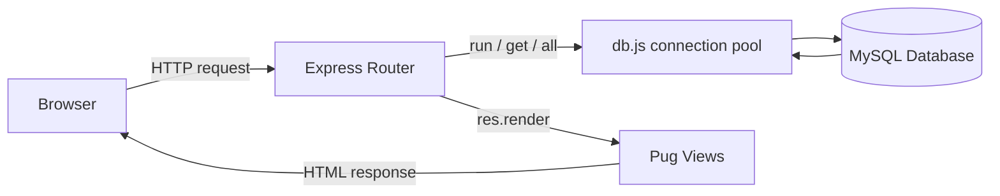

# Smart Transport Management System

A bus transport management web app I built for Metropolitan University, Sylhet. It keeps track of routes, stops, buses, drivers, students and schedules, and lets a student check whether a particular bus on a particular date is running, late, or broken down.

Stack: Node.js + Express, Pug templates, MySQL through XAMPP. No ORM, no React, no build step. Every query is plain SQL and every page is rendered on the server.

I wrote this README so someone who has never opened the project before can get it running and understand it without asking me anything.

## Contents

- [What it does](#what-it-does)
- [How it's put together](#how-its-put-together)
- [Files worth knowing about](#files-worth-knowing-about)
- [How to Run it](#How-to-Run-it)
- [The database](#the-database)
- [Login accounts](#login-accounts)
- [How bus status is worked out](#how-bus-status-is-worked-out)
- [What each page does to the database](#what-each-page-does-to-the-database)
- [Testing walkthrough](#testing-walkthrough)
- [What changed along the way](#what-changed-along-the-way)

---

## What it does

There are three kinds of accounts, plus a public side that needs no login at all.

**Students** sign up with their university email and their official Student ID (the one the university gave them — the app doesn't generate IDs). The account sits as `pending` until an admin approves it. Once they're in, the main thing they do is pick a route and a date and see the status of every bus on it.

**Drivers** don't sign themselves up; an admin creates the account. A driver sees the bus and route assigned to them along with their official schedule, and can start a trip, end a trip, report a delay, or report a breakdown. The reports are proper forms with dropdowns, not a free-text box — reason, location, and for a delay, how long.

**Admins** run everything else. Students, drivers, buses, routes, stops, schedules, plus official notices. A notice like "Bus 11-0018 will not run today" isn't just text on a page; it changes what a student sees when they check that bus.

Without logging in, anyone can browse the **Routes**, **Timetable** and **Notices** pages, and use **Find Your Bus** on the homepage to search by stop in either direction (to campus or from campus).

A few details that are easy to miss:

- The timetable filters by schedule period — regular, examination, summer, winter or special.
- The delay form works out the new estimated time itself, per schedule row, by adding the reported minutes to the scheduled time. Nothing is hard-coded.
- The location dropdown on a driver's delay form is populated from the real stops on that driver's own route, straight out of the database.
- A driver needs an assigned bus before Start Trip or the report buttons appear. All seven seeded drivers already have one.

## How it's put together

It's a plain server-rendered MVC-ish app. There's no JSON API and no frontend framework — Express builds the HTML on every request.



**Frontend** is Pug templates in `views/`, one stylesheet (`public/stylesheet/style.css`) and one small script (`public/javascripts/main.js`) that handles dropdown menus and the "are you sure?" dialogs on delete buttons.

**Backend** is `app.js` plus `routes/index.js`. Almost all the logic lives in that one router file, including the bus status calculation.

**Database access** goes through `mysql2/promise` in `db.js`, which exposes three helpers — `run`, `get` and `all` — used everywhere else. No ORM.

**Sessions, not tokens.** `express-session` holds `req.session.user = { id, role, ... }`, and a `requireRole(role)` middleware re-checks the role server-side on every protected route. Hiding a button in the UI is not access control on its own, so both are in place.

**Three separate logins** at `/login-admin`, `/login-driver` and `/login-student`, because each role lives in a different table with different rules. A student's `status` has to be `approved`, and student login needs the email *and* the exact Student ID together — that's deliberate.

**Passwords** are hashed with salted PBKDF2, 100,000 iterations, using Node's built-in `crypto` module, and compared with a timing-safe check. No plain text anywhere and no external hashing library.

## Files worth knowing about

`node_modules/` and the IDE junk (`.vscode/`, `*.esproj`, `*.slnx`) are left out.

| Path | What it does |
|---|---|
| `app.js` | Sets up the Express app — Pug view engine, session/body/static middleware, mounts the routers. |
| `bin/www` | The actual entry point that `npm start` runs. It waits for `db.initDatabase()` before the HTTP server starts listening, so no request ever arrives before MySQL is ready. |
| `db.js` | The whole database layer. Connection pool, the `run`/`get`/`all` helpers, schema creation for all 11 tables, the `notices` table migration for older installs, first-run seed data, and the password hashing. |
| `config/database.js` | Reads connection settings from `.env` with sensible XAMPP defaults. The only place connection details live. |
| `config/googleApi.js` | A placeholder for GPS/live tracking I never got to. Nothing uses it. |
| `.env` | Your DB host/port/user/password/name and the app's port. Already filled in for a default XAMPP setup (`root`, no password). |
| `package.json` | Dependencies and two scripts: `npm start` and `npm run db:demo`. |
| `routes/index.js` | Basically the whole application — public pages, all three logins, signup, admin panel, driver dashboard, student dashboard, every CRUD action, and the bus status logic. |
| `routes/users.js` | Leftover from the Express generator, mounted at `/users`. Nothing real uses it. |
| `views/` | One Pug template per page, with shared bits (header, footer, flash messages, form mixins) in `views/partials/`. |
| `public/` | The stylesheet and the one client-side script. |
| `utils/viewHelpers.js` | Formatting helpers — 12-hour time, title case, readable dates — available inside every template. |
| `database/smart_transport_management.sql` | Full schema and seed dump matching `db.js`, if you'd rather import through phpMyAdmin than let the app build it. |
| `database/demo_operations.sql` | A SQL script for walking through the database in a terminal — SELECT, INSERT, UPDATE, DELETE, CREATE and DROP, all on a disposable demo route and a temporary table. |
| `scripts/database-demo.js` | The automated version of the same demo (`npm run db:demo`). |

## How to Run it 

You need **Node 18 or newer** and **XAMPP with MySQL/MariaDB running**.

Apache isn't required — Node has its own HTTP server. Start Apache only if you want phpMyAdmin.

**1.** Extract the ZIP. Inside there's a folder called `Smart_Transport_Management_System/` — that's the real project. Open *that* one in VS Code, the folder that directly contains `package.json`, `app.js` and `db.js`, not the outer wrapper.

**2.** Open the XAMPP Control Panel and start MySQL.

**3.** Open a terminal in the project folder (`` Ctrl+` ``).

**4.** Install dependencies:

```bash
npm install
```

**5.** Start it:

```bash
npm start
```

Leave that terminal open, it's running the server. On the first run this also creates the database, the 11 tables, and the seed data. After that the terminal usually goes quiet — that's fine, it just means it's waiting for requests. If something is actually wrong you'll get a clear error and the process will exit.

**6.** Open [http://localhost:3000](http://localhost:3000).

That's the whole setup. Everything past this point is detail, database internals, and the testing walkthrough.

## The database

The database sets itself up. You don't have to run any SQL by hand. There are two ways to get there and you only need one of them.

### Option A — just run the app

Run `npm start` and it happens automatically. `bin/www` awaits `db.initDatabase()` before the server starts listening, and that does four things in order:

1. `ensureDatabaseExists()` runs `CREATE DATABASE IF NOT EXISTS smart_transport_management` on a short-lived connection, so a completely fresh MySQL install works with zero setup.
2. `createSchema()` creates all 11 tables in dependency order — parents before children, so the foreign keys are always valid.
3. `migrateNoticesTable()` handles older copies of this database, from before admin notices and structured driver reports existed. It adds the missing columns one `ALTER TABLE` at a time without touching any existing rows. On a fresh database it finds everything already there and does nothing.
4. Then, back in `initDatabase()`: create the admin account if there isn't one, and if the `routes` table is empty, seed the real route/stop/bus/driver/schedule data plus two demo students.

Every step is guarded by `IF NOT EXISTS` or an emptiness check, so it's safe to run on every boot forever.

### Option B — import the SQL file

Start Apache, open phpMyAdmin, go to **Import**, and import `database/smart_transport_management.sql`. Same result in one step. Use this on a fresh database only, not to upgrade an existing one — there's a comment at the top of the file about that.

Pick one or the other. Doing both won't break anything but there's no reason to.

### Schema

Eleven tables, all InnoDB. That matters — a different engine would accept invalid foreign key references without complaining.

| Table | Purpose |
|---|---|
| `admins` | Admin login accounts |
| `routes` | Named routes, e.g. "Rikabibazar - Shahi Eidgah - Tilagarh" |
| `stops` | Ordered stops along a route |
| `buses` | Physical buses, optionally assigned to a route |
| `drivers` | Driver accounts, optionally assigned to a bus and route |
| `students` | Student accounts with an approval `status` and a required, unique `student_id` |
| `schedules` | Departure/arrival times for a bus on a route, by period |
| `notices` | Admin notices *and* structured driver delay/breakdown reports |
| `bookings` | Left in place for older installs. The booking feature is gone, nothing writes here. |
| `trips` | One run of a bus, started and ended by its driver |
| `trip_boardings` | Also left in place. The passenger counting feature is gone. |

`notices` does most of the interesting work in this version, so here are its columns:

| Column | Meaning |
|---|---|
| `driver_id` | Set on a driver's report, `NULL` on an admin notice |
| `admin_id` | The other way round |
| `notice_type` | `delayed`, `breakdown`, `not_running` or `general` — this is what drives the status a student sees |
| `bus_id` | The bus this targets. A driver report always has one; an admin can leave it blank to hit the whole route. |
| `route_id` | The route this targets |
| `notice_date` | The single date it applies to. Nothing applies to every day forever. |
| `reason` | `Traffic`, `Bus Problem`, `Mechanical Problem`, `Bus Fault` or `Other` |
| `reason_other` | The short explanation typed in when the reason is `Other` |
| `stop_id` | Where it happened, if the driver picked a stop |
| `delay_minutes` | 10, 20, 30, 40 or 60 |
| `message` | The one readable line shown wherever notices are listed, built from the fields above |

### Foreign keys

| Key | References | On delete |
|---|---|---|
| `stops.route_id` | `routes.id` | CASCADE |
| `buses.route_id` | `routes.id` | SET NULL |
| `drivers.bus_id` | `buses.id` | SET NULL |
| `drivers.route_id` | `routes.id` | SET NULL |
| `drivers.created_by_admin` | `admins.id` | SET NULL |
| `schedules.bus_id` | `buses.id` | CASCADE |
| `schedules.route_id` | `routes.id` | CASCADE |
| `notices.driver_id` | `drivers.id` | CASCADE |
| `notices.admin_id` | `admins.id` | SET NULL |
| `notices.bus_id` | `buses.id` | CASCADE |
| `notices.route_id` | `routes.id` | CASCADE |
| `notices.stop_id` | `stops.id` | SET NULL |
| `bookings.student_id` | `students.id` | CASCADE |
| `bookings.route_id` | `routes.id` | CASCADE |
| `trips.bus_id` | `buses.id` | CASCADE |
| `trips.driver_id` | `drivers.id` | CASCADE |
| `trips.route_id` | `routes.id` | SET NULL |
| `trip_boardings.trip_id` | `trips.id` | CASCADE |
| `trip_boardings.student_id` | `students.id` | CASCADE |

Put simply: delete a route and its stops, schedules and notices go with it while any bus or driver pointing at it just gets unassigned. Delete a bus or driver and their schedules, trips and notices go too. Delete a student and their bookings go.

## Login accounts

All of these are seeded on first run and all of them actually work.

| Role | Login | Password |
|---|---|---|
| Admin | username `admin` | `admin123` |
| Student (approved) | `demo.student@mu.edu.bd` + ID `STU000001` | `student123` |
| Student (pending) | `pending.example@mu.edu.bd` + ID `STU000002` | `student123` |
| Driver | e.g. `sojib.driver@mu.edu.bd` | `driver123` |

The pending student is there on purpose so you can demonstrate the approval flow — logging in with it is blocked until an admin approves the account.

Remember that student login needs the email and the exact Student ID together.

All seven seeded drivers, with the bus each one starts on:

| Driver email | Bus | Route |
|---|---|---|
| `sojib.driver@mu.edu.bd` | 11-0018 | Medina Market - Rikabibazar - Shahi Eidgah - Tilagarh |
| `mintu.driver@mu.edu.bd` | 11-0900 | Rikabibazar - Shahi Eidgah - Tilagarh |
| `shahadat.driver@mu.edu.bd` | 11-0944 (Trial) | Rikabibazar - Shahi Eidgah - Tilagarh |
| `forid.driver@mu.edu.bd` | New-2 | Pathantula - Subidbazar - Ambarkhana - Tilagarh |
| `abed.driver@mu.edu.bd` | 11-0967 | Rikabibazar - Chowhatta - Naiorpul - Tilagarh |
| `monir.driver@mu.edu.bd` | New-1 | Temukhi - Medina Market - Subidbazar - Tilagarh |
| `mohsin.driver@mu.edu.bd` | 11-0010 | Humayun Chottor - Shibganj - Tilagarh |

They all use `driver123`.

One nice touch in the seed data: there's already a delay report from Sojib (traffic near Chowhatta, 15 minutes) dated to whatever day you first start the app. Log in as the demo student, pick his route and today's date, and Bus 11-0018 shows up as **Delayed** straight away — the whole feature demonstrated without setting anything up.

## How bus status is worked out

This is the core of the student dashboard, so it's worth going through properly.

When a student picks a route and a date, the app pulls every regular-period schedule for that route and works out a status for each one on the spot. Nothing is stored or cached. It only looks at three things:

1. The schedule's own time.
2. The selected date, compared to today.
3. The most recent notice targeting that exact bus on that exact date — or the whole route, if there's no bus-specific one.

There are six possible statuses:

| Status | When you see it |
|---|---|
| On Time | A future date with no problem notice |
| Upcoming | Today, and the scheduled time hasn't come yet |
| Departed | Today and the time has passed, or the date is in the past |
| Delayed | A driver reported a delay for that bus on that date. Shows the reason, location, delay length, and a new estimated time. |
| Breakdown | A driver reported a mechanical fault for that bus on that date |
| Not Running | An admin posted a "not running" notice for that bus or route on that date |

Delay, breakdown and not-running always win over the date/time calculation. A future date won't show as "On Time" if there's a notice saying otherwise, and a past date's bus won't quietly show as "On Time" either.

A `general` admin notice ("today's schedule has changed") doesn't override anything. It just rides along underneath whatever status the date and time already produced.

Two rules that come up a lot when testing:

- If there are two notices for the same bus and date, only the newest one counts. A driver's follow-up report supersedes their earlier one, and an admin correcting a notice supersedes the original.
- A notice aimed at one specific bus beats a route-wide one. "Bus 11-0018 will not run today" affects that bus only; every other bus on the route carries on as normal.

The estimated time on a delay is the schedule's own time plus the reported minutes, calculated per schedule row rather than once for the whole bus.

## What each page does to the database

Checked against `routes/index.js`:

| Feature | Table | Operation |
|---|---|---|
| Admin login | admins | SELECT |
| Student signup | students | SELECT (uniqueness) + INSERT |
| Student login | students | SELECT |
| Admin adds a student | students | SELECT (uniqueness) + INSERT |
| Admin edits a student | students | SELECT (uniqueness) + UPDATE |
| Approve / reject / suspend / re-activate | students | UPDATE |
| Delete student | students | DELETE |
| Add driver | drivers | INSERT |
| Driver login | drivers | SELECT |
| Edit driver / assign bus / activate / deactivate | drivers | UPDATE |
| Delete driver | drivers | DELETE |
| Add, edit, delete bus | buses | INSERT / UPDATE / DELETE |
| Add, edit, delete route | routes | INSERT / UPDATE / DELETE |
| Add, edit, delete stop | stops | INSERT / UPDATE / DELETE |
| Add, edit, delete schedule | schedules | INSERT / UPDATE / DELETE |
| Driver reports a delay | notices | INSERT |
| Driver reports a breakdown | trips + notices | UPDATE + INSERT |
| Admin creates a notice | notices | INSERT |
| Admin deletes a notice | notices | DELETE |
| Student checks bus status | schedules + notices | SELECT (joined, by route + date) |
| Start / end trip | trips | INSERT / UPDATE |

On who can do what: the admin is the only account that can create, update or delete a driver, student, bus, route, stop or schedule. A driver can read their own profile and schedule and can insert into `notices` and `trips` for their own reports and trips, but can't touch another driver's account and never writes to `routes`, `stops` or `schedules` at all.

## Testing walkthrough

A way to exercise every feature after a fresh `npm start`. All the test values below are throwaway and won't damage real data.

### 1. Admin login

Go to `/login-admin`, sign in with `admin` / `admin123`. You should land on the Overview tab with the stat cards (total students, pending registrations, total drivers) and a recent notices table.

### 2. Student CRUD

Admin Panel → Student Management → Add Student. Name `Test Student`, email `test.student@example.com`, Student ID `TEST0001`, password `test1234`.

The ID is required — there's no "leave blank to auto-generate" any more.

Add it, and you'll get a green flash message and see the row in the All Students table already marked **Approved**, since admin-created students skip the approval step. Edit it, change the department to `Testing`, save. Then delete it and confirm the prompt. That's all four operations.

### 3. Driver CRUD

Driver Management → Add Driver. Name `Test Driver`, email `test.driver@example.com`, password `test1234`, leave the bus as "No bus yet."

It appears in the drivers table as Active. Edit it, set the phone to `01700000000`, save. Delete it and confirm.

### 4. Route / bus / stop / schedule CRUD

- Route Management → Add Route: `Demo Route`, description `CRUD Test`, status **Inactive** so it never shows publicly while you test.
- Bus Management → Add Bus: `TEST-01`.
- Stop Management → Add Stop: route `Demo Route`, name `Test Stop`.
- Schedule Management → Add Schedule: bus `TEST-01`, route `Demo Route`, arrival `09:00`.

Each shows up in its table immediately. Change the schedule's arrival to `09:30` to confirm updates work.

For cleanup, deleting `Demo Route` on its own takes the stop and schedule with it, since both foreign keys cascade. If you'd rather watch each delete happen separately, go schedule → stop → bus → route.

### 5. Student signup and approval

Go to `/signup` and register with email `test.applicant@mu.edu.bd`, Student ID `TESTSTU01`, password `test1234`. You'll get the "pending Admin approval" message.

Try logging in at `/login-student` straight away — it'll be blocked, which is the point.

Switch to the admin window, go to Student Management → Pending Registrations, and approve it. Go back and log in again; this time it works.

Then try signing up once more with the same Student ID and a different email. It should be rejected as already registered, which is the unique-ID validation doing its job.

### 6. Checking bus status

Log in as `demo.student@mu.edu.bd` / `STU000001` / `student123`.

Under **Check Bus Status**, pick the route `Medina Market - Rikabibazar - Shahi Eidgah - Tilagarh (Teacher Transport)`, leave the date on today, and hit Check Status. Bus 11-0018 should already show a **Delayed** badge, the reason ("Traffic near Chowhatta, approx. 15 minutes") and an estimated time. That's the seeded notice.

Now change the date to tomorrow and check again — the same bus goes back to **On Time**, because a notice only ever covers the one date it was posted for.

Pick a route with no notices and check today. Depending on the current time you'll get **Upcoming** or **Departed**.

### 7. Reporting a delay

Log in as `sojib.driver@mu.edu.bd` / `driver123`. His route has Chowhatta as a real stop, which makes it a good one to demo.

Scroll to **Report a Delay**, pick reason `Traffic`, location `Chowhatta`, duration `20 minutes`, submit. You get a flash message and the report appears under My Recent Notices.

Switch back to the student and check that route for today again. Bus 11-0018 now shows 20 minutes instead of the seeded 15, because the newest report supersedes the old one.

### 8. Reporting a breakdown

Click **Start Trip** first — breakdown reporting needs a trip in progress, same as ending one does.

Under **Report Breakdown**, pick `Mechanical Problem`, leave the location blank or pick a stop, submit. The trip's badge changes to **Breakdown** and it drops off the "start a new trip" option, since End Trip and Report Breakdown only appear while a trip is `in_progress`.

As admin, check Live Trips & Breakdowns → Breakdown Reports and you'll see the same report with bus, route, driver, message and time. No passenger counts — that feature was removed.

As the student, that driver's route now shows **Breakdown** for today.

### 9. Admin notice

Admin Panel → Notice Management → Create Admin Notice. Bus `11-0018`, leave the route to fill in automatically, date today, type `Not Running`, message `Bus 11-0018 will not run today.`

Post it and it appears at the top of All Notices with a Not Running badge. Check that route as the student and the bus now shows **Not Running** with your exact message.

Worth knowing: this replaces whatever delay or breakdown you tested in steps 7 and 8, because only the newest notice for a bus and date applies. That's expected. Delete the notice from Notice Management (or wait for the next day) to put the bus back to its normal status.

Then click Delete next to it and confirm — it disappears from the list right away.

### 10. Logout

Logout from the profile menu behaves the same for all three roles and drops you back on the homepage.

## What changed along the way

The project started on SQLite and was moved to MySQL for XAMPP. After that it went through one bigger revision:

- **Student IDs are required and no longer auto-generated.** A real student already has an official ID from the university, so it's a required, unique field at signup and when an admin adds someone.
- **The booking system was removed.** The `bookings` table is still there, unused, so older installs don't break.
- **Automatic passenger counting was removed** for the same reason, and `trip_boardings` is kept the same way. Start Trip, End Trip and Report Breakdown all stayed, since a driver still needs to log a trip and flag a mechanical fault. Only the passenger count part is gone.
- **The student dashboard is now route + date status checking** instead of the old generic "regular schedule" preview table.
- **Driver reports became structured.** A delay is a reason, a location and a duration; a breakdown is a reason and a location. The location options come from that driver's own route's stops in the database.
- **Admins can create notices now**, not just review and delete driver ones, and an admin notice can set a bus or a whole route to Not Running for a specific date.

Through all of that the existing admin CRUD for students, drivers, buses, routes, stops and schedules stayed exactly as it was, and the design, branding and Pug/Express/MySQL stack didn't change.
